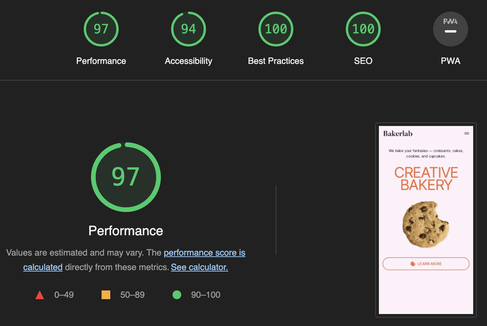

# Creative bakery landing page

A landing page of a craft bakery. It presents a variety of baked goods, information about the bakery and its customers, and a contact section for placing sweet product orders.

# [DEMO](https://oksana-vas.github.io/creative-bakery-landing/)

The landing page implemented according to the [Figma design](https://www.figma.com/file/dY3izAm0Vspsmra4lQWQIP/Bakerlab-FE-students?node-id=0%3A1).

# Technologies used

- HTML5
- CSS3
- Sass (SCSS)
- BEM methodology

# Features Overview

The design is adaptable and responsive, guaranteeing compatibility across different browsers. It operates smoothly on screens of various sizes, including mobile, tablet, and desktop versions. The development process followed a mobile-first strategy.

The code strictly complies with HTML5 and CSS3 standards. Sass (SCSS) is utilized for styling to improve user load efficiency and avoid code redundancy, incorporating advanced features like mixins, extends, and conditional operators.

Class naming follows the BEM methodology, promoting code readability, clarity, and simplifying maintenance and reuse by preventing naming conflicts.

Semantic and meta tags are integrated to optimize for SEO and improve accessibility.

*see google lighthouse report below*

